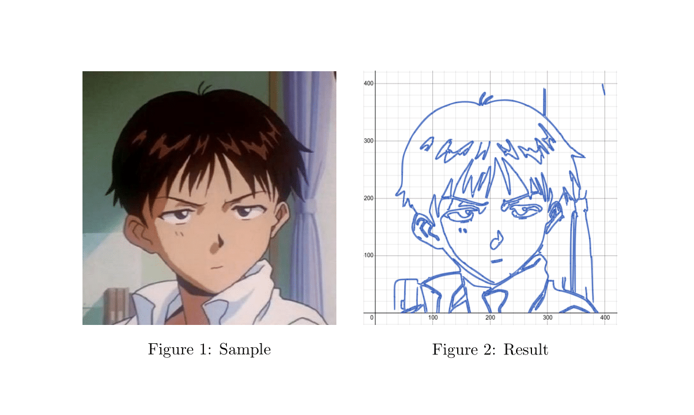
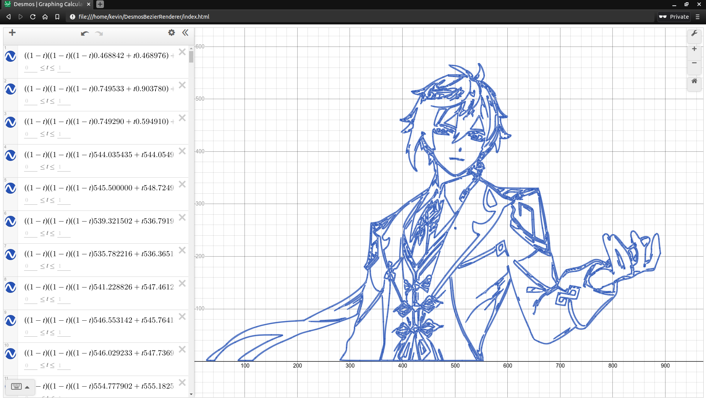

# Desmos Bezier Renderer

A simple image/video to Desmos graph converter run locally. Rotoscopes images using Canny and Potrace edge detection as Bezier curves on Desmos Graphing Calculator.



## Setup
#### This guide won't work out of the box on Windows. The easiest way to do this on Windows is to [download WSL](https://www.microsoft.com/store/productId/9N6SVWS3RX71) to run all the commands below. You can find it produces under the `\\wsl$\Ubuntu-20.04\home` path on your PC.
Install dependencies
```sh
apt update
apt install git python3-dev python3-pip build-essential libagg-dev libpotrace-dev pkg-config
```

Clone repository
```sh
git clone https://github.com/kevinjycui/DesmosBezierRenderer.git
cd DesmosBezierRenderer
```

Install requirements
```sh
python3 -m venv env
. env/bin/activate
pip3 install -r requirements.txt
```
Create a directory called `frames` and add images named `frame%d.png` where `%d` represents the frame-number starting from 1. To render just a single image, add a single image named `frame1.png` in the directory. Works best with 360p to 480p resolution (may have to lower the resolution further with more complex frames). 
```sh
mkdir frames
...
```
#### Settings
Constants in the `backend.py` file can be changed to optimise or customise your render via command-line arguments.

```sh
$ python backend.py -h
backend.py -f <source> -e <extension> -c <colour> -b -d -l -g --static --block=<block size> --maxpblock=<max expressions per block>

	-h	Get help

-Render options

	-f <source>	The directory from which the frames are stored (e.g. frames)
	-e <extension>	The extension of the frame files (e.g. png)
	-c <colour>	The colour of the lines to be drawn (e.g. #2464b4)
	-b		Reduce number of lines with bilateral filter for simpler renders
	-d		Download rendered frames automatically
	-l		Reduce number of lines with L2 gradient for quicker renders
	-g		Hide the grid in the background of the graph

-Optimisational options

	--static					Use a static number of expressions per request block
	--block=<block size>				The number of frames per block in dynamic blocks
	--maxpblock=<maximum expressions per block>	The maximum number of expressions per block in static blocks
```

You can use the optimisational options to change the number of expressions the backend will send to the frontend per call (too much will cause a memory error, too little could kill the backend with too many requests). Note that a "block" refers to what is passed from the backend to the frontend per HTTP request. These only really matter if you are rendering a video.

Use `python3 backend.py -h` to see the above help message. Run without any command-line arguments to create a rendering with the same settings as seen in [this video](https://www.youtube.com/watch?v=BQvBq3K50u8). 

To revert the code to be exactly as it was when the video was released, run `git checkout 47b10ea98b04b98ce46e54a46adde27bcb52e53e` first (this will cause the rendering to be significantly slower).

#### Running the command

Run backend (This may take a while depending on the size and complexity of the frames). It should eventually show that the server is running on `localhost:5000`.
```sh
python3 backend.py
```

The following is an example of the output
```sh
$ python3 backend.py 
Desmos Bezier Renderer
Junferno 2021
https://github.com/kevinjycui/DesmosBezierRenderer
-----------------------------
Processing 513 frames... Please wait for processing to finish before running on frontend

--> Processing complete in 4.4 seconds

 * Serving Flask app "backend" (lazy loading)
 * Environment: production
   WARNING: This is a development server. Do not use it in a production deployment.
   Use a production WSGI server instead.
 * Debug mode: off
 * Running on http://127.0.0.1:5000/ (Press CTRL+C to quit)

```

Load `index.html` into a web browser and put `f=1` into the first formula in the formula window. The image should start rendering or the video should start playing at a slow rate.



## Attribution

©Copyright Junferno 2021. This program is licensed under the GNU General Public License. Please provide proper credit to the author (Junferno) in any public media that uses this software.