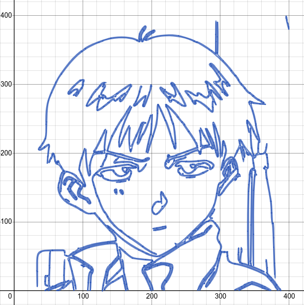

# Desmos Bezier Renderer

A simple image/video to Desmos graph converter run locally. Rotoscopes images using Canny and Potrace edge detection as Bezier curves on Desmos Graphing Calculator.

### Sample


### Result


## Setup
#### This guide won't work out of the box on Windows. The easiest way to do this on Windows is to [download WSL](https://www.microsoft.com/store/productId/9N6SVWS3RX71) to run all the commands below. You can find it produces under the `\\wsl$\Ubuntu-20.04\home` path on your PC.
Install dependencies
```sh
apt update
apt install git python3-dev python3-pip build-essential libagg-dev libpotrace-dev pkg-config
```

Clone repository
```sh
git clone https://github.com/kevinjycui/DesmosBezierRenderer.git
cd DesmosBezierRenderer
```

Install requirements
```sh
python3 -m venv env
. env/bin/activate
pip3 install -r requirements.txt
```
Create a directory called `frames` and add images named `frame%d.png` where `%d` represents the frame-number starting from 1. To render just a single image, add a single image named `frame1.png` in the directory. Works best with 360p to 480p resolution (may have to lower the resolution further with more complex frames). 
```sh
mkdir frames
...
```
#### Settings
Constants in the `backend.py` file can be changed to optimise or customise your render. Note that a "block" refers to what is passed from the backend to the frontend per HTTP request.
| Variable | Type | Description | Notes |
| --- | --- | --- | --- |
| `DYNAMIC_BLOCK` | Boolean | Automatically find the right block size | If unsure, leave as true
| `BLOCK_SIZE` | Integer | Number of frames per block | Ignored if `DYNAMIC_BLOCK` is true |
| `MAX_EXPR_PER_BLOCK` | Integer | Maximum lines per block, doesn't affect lines per frame | Ignored if `DYNAMIC_BLOCK` is false |
| `FRAME_DIR` | String | The folder where the frames are stored relative to this file | `'frames'` |
| `FILE_EXT` | String | Extension for frame files | `'png'`, `'jpg'`, etc. |
| `COLOUR` | String | Hex value of colour for graph output | Desmos blue is `'#2464b4'` |
| `DOWNLOAD_IMAGES` | Boolean | Download each rendered frame automatically (works best in Firefox) | If true, each frame is screenshotted automatically. Works best in Firefox, as chromium browsers will constantly prompt for downloads
| `USE_L2_GRADIENT` | Boolean | Creates less edges but is still accurate (leads to faster renders) | |
| `SHOW_GRID` | Boolean | Show the grid in the background while rendering | |

You can change the `DYNAMIC_BLOCK`, `BLOCK_SIZE`, and `MAX_EXPR_PER_BLOCK` to change the number of expressions the backend will send to the frontend per call (too much will cause a memory error, too little could kill the backend with too many requests). These only really matter if you are rendering a video.

Run backend (This may take a while depending on the size and complexity of the frames). Should eventually show that the server is running on `localhost:5000`.
```sh
python3 backend.py
```

Load `index.html` into a web browser and put `f=1` into the first formula in the formula window. The image should start rendering or the video should start playing at a slow rate.
